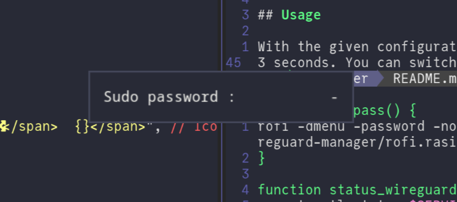
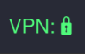

# Wireguard-manager

This is a simple, stupid `waybar` extension for toggling `wireguard`. It uses
`rofi` for password prompting, but you could use anything you like.

## Screenshots


*VPN switched off, as seen in Waybar.*


*Password prompt with Rofi.*


*VPN switched on, as seen in Waybar.*

## Prerequisites

You need to be able to manage Wireguard using systemd, even though it should
not be too difficult to change the script to use `wg` directly.

If your Wireguard interface is `wg0`, enable the service using:

```bash
sudo systemctl enable wg-quick@wg0.service
sudo systemctl daemon-reload
```

You also need `rofi`.

## Installation

Clone the repository in `~/.config/waybar/wireguard-manager`, then add this to
`~/.config/waybar/config` :

```json
"custom/wireguard-manager": {
    "exec": "exec ~/.config/waybar/wireguard-manager/wireguard-manager.sh -s",
    "format": "{icon}",
    "format-icons": {
        "connected": "<span color=\"#50fa7b\">VPN: 🔒</span>",
        "disconnected": "<span color=\"#ff5555\">VPN: 🔓</span>",
    },
    "interval": "once",
    "on-click": "~/.config/waybar/wireguard-manager/wireguard-manager.sh -t && pkill -SIGRTMIN+1 waybar",
    "return-type": "json",
    "signal": 1,
}
```

See [Waybar's wiki](https://github.com/Alexays/Waybar/wiki/Module:-Custom) for
more information on how to customize this.

### Toggling WireGuard "manually"

If you intend on turning your Wireguard tunnel on and off through other means other than clicking on this waybar module, it can be useful to set the module itself in a different fashion:

```json
"custom/wireguard-manager": {
    "interval": 3,
    "return-type": "json",
    "format-icons": {
        "connected": "<span color=\"#50fa7b\">VPN: 🔒</span>",
        "disconnected": "<span color=\"#ff5555\">VPN: 🔓</span>"
    },
    "on-click": "exec ~/.config/waybar/wireguard-manager/wireguard-manager.sh -t",
    "exec": "exec ~/.config/waybar/wireguard-manager/wireguard-manager.sh -s",
    "format": "{icon}"
}
```

This is because the version of the module presented first updates itself only when clicked on, to avoid constant polling of the status of the systemd service for Wireguard. If you do use other means to set your tunnel up or down (such as `sudo systemctl stop wg-quick@wg0.service`), it is recommended to use this other version of the module, as it polls the current status of the systemd service every 3 seconds, updating the status of the module without requiring the user to click on it.

## Usage

With the given configuration, the status of the connection will be updated every
3 seconds. You can switch on/off the connection to your peer by clicking on the
icon in Waybar.

## Customization

This module is simple enough for anyone to customize it. You can change the way
the rofi prompt looks by editing `rofi.rasi`, or you can use any other way to
prompt the password. You can also change the way things look in Waybar by
editing the sample configuration.

## Contributions

Contributions are most welcome, feel free to submit any idea or improvement you
can think of.

## See also

If you are a NetworkManager user, maybe you should rather use
[wireguard-rofi-waybar ](https://github.com/HarHarLinks/wireguard-rofi-waybar), which seems to offer
way more functionalities!
